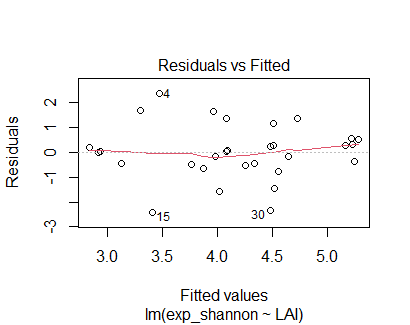
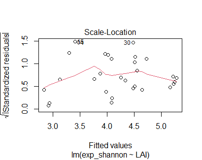

---
title: "Introduction to Generalised Least Squares models"
author: "Hannah Udall"
date: "2023-11-27"
output: html_document:
    self_contained: false

---
  
```{r, echo=FALSE}
library(knitr)
knit("index.Rmd")
```

<p align="center">
  
</p>

<hr style="border-color: #999; border-width: 2px;">

*Created by Hannah Udall - last updated 01-12-23*

<hr style="border-color: #999; border-width: 2px;">

This tutorial is aimed at people who already have a good understanding of linear models, the statistical assumptions of these models and have a good level of R proficiency (ability to use functions like ggplot in the ggplot2 package). If you are less confident in these topics I recommend briefly looking at [these](Useful Materials/Coding-club-tutorials.html) tutorials for the appropriate background information.

**Acknowledgements:** Thanks are due to my fieldwork group (Luisa Dickenmann, Rebecca Hies, Kinga Kaszap, Thomas Pendlebury, Else Radeloff and Tegan Williams) whom I collected the data with for the Spatial autocorrelation part of the tutorial, and Mathew Rees who was our supervisor during this project and introduced me to the concept of generalised least square models. Also to Claudia Colesie, who taught me about semivariance in the Ecological Measurement course.

There is a lot of text in this tutorial, as the form of variance, spatial and temporal autocorrelation varies significantly between datasets, so a good understanding of the model is important. 


<a name="download"></a> To get all the materials for this tutorial head <a href="https://github.com/EdDataScienceEES/tutorial-orka4" target="_blank">this GitHub repository</a>, click on the Code button and Download ZIP and unzip the folder. Alternatively clone the repositary to your github- more information on how to do this is found [here](https://ourcodingclub.github.io/tutorials/git/index.html).


## Tutorial Aims

### <a href="#section1"> 1. What is a GLS model and why should I care?</a>

### <a href="#section2"> 2. Temporal autocorrelation</a>
* <a href="#subsection1">What is temporal autocorrelation and why is it a problem?</a>
* <a href="#subsection2">Recognising temporal autocorrelation</a>
* <a href="#subsection3">Which correlation structure do I have? The GLS model</a>
* <a href="#subsection4">Plotting our model</a>

### <a href="#section3"> 3. Non-constant variance</a>
* <a href="#subsection5">What is heteroskedasticity and why is it a problem?</a>
* <a href="#subsection6">Recognising heteroskedasticty</a>
* <a href="#subsection7">Which variance structure do I have? The GLS model</a>
* <a href="#subsection8">Plotting our model</a>
   
### <a href="#section4"> 4. Spatial autocorrelation</a>
* <a href="#subsection9">What is spatial autocorrelation and why is it a problem?</a>
* <a href="#subsection10">How to check for spatial autocorrelation: semivariance and semivariograms</a>
* <a href="#subsection11">The GLS model</a>
* <a href="#subsection12">Plotting our model</a>

### <a href="#section5"> 5. Challenge time !</a>

### <a href="#section6"> 5. The end</a>
* <a href="#subsection13">Tutorial Outcomes</a>

<hr style="border-color: #999; border-width: 2px;">
  
## <a name="section1"></a> What is a GLS model and why should I care?
This tutorial is an introduction to the usefulness of **generalised least square models**, or gls for short. These models are incredibly useful as they allow you to statistically model data whose data is not necessarily independent and/or has non-constant variance (heteroskedastic). Linear models can only be created with condfidence if certain statistical assumptions are met. Two of these assumptions are **independence of datapoints** and **constant variance**. This tutorial will hopefully help anyone who has data that is not independent or does not have constant variance- as your data can still be modelled!

The tutorial is for running a gls model with **continuous** predictor and response variables. GLS models can be executed for categorical variables, however it gets a bit more complicated so we are not going to cover this here.

So let's begin! 

Open `RStudio` and create a new script by clicking on `File/ New File/ R Script`. 
Let's set the working directory to where you have saved the materials for this tutorial (mentioned <a href="#download"> here</a>) by replacing "your_filepath" with the file path of the relevant folder.

```r
# Set the working directory
setwd("your_filepath")
```  
And let's load the relevant **packages**.
```r
# Load packages
library(nlme)
library(tidyverse)
library(lmtest)
library(geosphere)
library(ggeffects)
library(ape) #For moran I
```

If you don't have them already, remember to install them as so:

```r
install.packages("package name")
```
<div style="background-color: #ffd700; padding: 10px; border: 1px solid #4682b4; border-radius: 10px; margin-top: 20px; margin-bottom: 20px;">
  <p>This tutorial is split into three sections: 

* Section one discusses how to deal with **temporal autocorrelation** which is when your datapoints are not independent through time.

* Section two discusses how to deal with **non constant variance** which is when your (typically linear) model has non-constant variance.

* Section three discusses how to deal with **spatial autocorrelation** which is when your datapoints are not independent through space.</p>


If you already know which part you need to learn about, feel free to skip to the relevant section by clicking on the relevant aim in the 'tutorial aims' section above. On the otherhand, if you want to complete the whole tutorial, or don't know what the three section headings mean, complete the tutorial in order.

## Temporal autocorrelation <a name="section2"></a> 

### <a name="subsection2"></a>  What is temporal autocorrelation and why is it a problem?

<div style="background-color: #add8e6; padding: 10px; border: 1px solid #4682b4; border-radius: 10px; margin-top: 20px; margin-bottom: 20px;">
  <p>**Temporal autocorrelation** is when your data has an internal structure that means datapoints separated by certain intervals of time are more similar than other points. Often this can be seen as data collected daily being more similar to days close to it, however other structures can also be apparent.</p>
</div>


Temporal autocorrelation is a problem as it negates the statistical assumption of **independence of observations**. In this tutorial we are going to learn how to check for temporal autocorrelation in our data and what to do if we find it.

#### Load the data

Since we are using a dataset in-built to R, we can just write the name of the dataset and rename it to 'airdata'.
<a name="airquality"></a>
```r
#DATA
airdata<- airquality
```

#### Explore the data

The data we are going to be using in this part of the tutorial is a dataset pre-loaded onto R called 'airquality'.<a name="data"></a> This dataset contains data about the air quality in New York in 1973 and has data from May to September.

Let's explore the data using the functions names() and head()

```r
names(airdata) #returns the column headings
head(airdata) #returns the first five rows
```
In this tutorial we are going to look at how the concentration of ozone changes through time.

As we are going to be looking at the **temporal structure**, we need to understand how the temporal data is inputted. To do this, run the following code
to understand how often data is collected.

```r
unique(airdata$Day) #returns the unique values in the 'Day' column of our dataset
unique(airdata$Month) #returns the unique values in the 'Month' column of our dataset
```

From this we can see that the 'Day' column contains the **date**, and the 'Month' column contains the **numerical month** (where 1 = January).
To analyse how the variables change over time we need a continuous time variable. To create this we are going to concatenate 'Day' and 'Month' and use the following code to calculate the day of the year.

```r
airdata$Date <- as.Date(paste(airdata$Month, airdata$Day, sep = "-"), format = "%m-%d") #concatenate Day and Month

airdata$DayOfYear <- as.numeric(format(airdata$Date, "%j")) # Extract the day of the year and create a new column to contain these values.
```
Now, let's run the following code to check the 'DayOfYear' has turned out like we expect.

```r
unique(airdata$DayOfYear) #returns the unique values in 'DayOfYear' column.
```

We shall **delete** the other 'time' columns to avoid confusion later in the tutorial.
```r
airdata<-airdata %>% select(-c("Day", "Month","Date"))
```

### <a name="subsection2"></a> Recognising temporal autocorrelation

Since we want to run a statistical model looking at how ozone concentration changes with time, we are going to test for temporal autocorrelation in the ozone variable. 

To visually check for temporal autocorrelation between time 't' and time 't+1' we can create two dataframes, one lagged and one not. 

First, we want to check the structure of the ozone data. To do this we shall look at the unique values.
```r
unique(airdata$Ozone)
```
Since there are NA values in the column, we need to see how often they occur and whether they are scattered throughout the dataset or clumped. This will tell us whether removing the rows will alter our dataset in a big way and affect our analysis.
```r
na_count <- sum(is.na(airdata$Ozone)) #Counts the number of missing values in the ozone column
na_rows <- which(is.na(airdata$Ozone)) #The 'which' function gives us the indices of the rows with missing values.
nrow(airdata) #Counts the number of rows in the airdata dataframe.
```
As the number of missing values ('NA' values) are small compared to the length of the dataframe, and they are scattered not clumped, we can remove them.

```r
airdata <- airdata[!is.na(airdata$Ozone), ] #Remove NA values.
data3_1<- airdata[-116,] #dataframe containing rows 1 to n-1. Last row is removed so it is the same dimensions as lagged dataframe.
data3_2<-airdata[-1,] #dataframe containing rows 2 to n. Lagged dataframe, compared to data3_1.
plot(data3_1$Ozone, data3_2$Ozone) #Plot t against t+1
```
If there was **no temporal autocorrelation** we would expect **no pattern** in the plot, however there is which suggests autocorrelation. This quick plot has only checked for autocorrelation with a time lag of 1 (here 1 day). To see if there is correlation between different time intervals, we can plot an **autocorrelation function** and a **partial autocorrelation function**.

```r
acf(airdata$Ozone, lag.max=31) #autocorrelation function
pacf(airdata$Ozone, lag.max=31) #partial autocorrelation function
```
The plots should look like so:
<div style="display: flex; justify-content: space-between;">
  
  
</div>

If the vertical black line is **above** the dotted line it means there is temporal autocorrelation at that lag value.

**Note:** The autocorrelation function (ACF) for temporal patterns is always 1 at lag 0.

<div style="background-color: #add8e6; padding: 10px; border: 1px solid #4682b4; border-radius: 10px; margin-top: 20px; margin-bottom: 20px;">
  <p>The **autocorrelation function (acf())** includes the **cumulative** effect of intermediate lags, while the **partial autocorrelation function (pacf())** isolates the **direct relationship** between a data point and its lagged values. </p>
</div>

'lag.max' allows you to state how many lag values you want included on the x axis. We have chosen 31 here to replicate the 30/31 days in the month's in our dataset.

Since the black vertical line **surpasses the dotted line** at multiple lag values in both plots we can conclude there is temporal autocorrelation in this data. 
We shall analyse these plots more later on in the tutorial.

#### Numerical methods of testing for temporal autocorrelation

To test for temporal autocorrelation **numerically** we can run a correlation test or calculate the correlation using the code below. 

```r
#Run a correlation test
cor<- cor.test(data3_1$Ozone,data3_2$Ozone) #Using our dataframes with time lag = 1 from earlier.

p<-cor$p.value  #extracts the p value from the summary statistics of the correlation test.
```
If the p value is less than the significance threshold (often 0.05), the null hypothesis of correlation is accepted.
The p value is very small, which confirms temporal autocorrelation with a time lag of 1.

```r
#Calculate correlation
cor(data3_1$Ozone,data3_2$Ozone)
```
The correlation is always between **-1 and 1**. A positive number signifies a positive linear relationship, a negative number signifies a negative linear relationship and if it is near zero this signifies zero correlation. The strength of the correlation is based on the magnitude of the correlation. Here we have moderate correlation between time 't' and 't+1'.

### <a name="subsection3"></a> Modelling temporally autocorrelated data

This is when the **generalised least squares model** comes in! 
This model allows you to account for autocorrelation which is super important because without accounting for autocorrelation you might get a significant result when in reality there is none- it is just an internal correlation structure causing a relationship!

Gls works similarly to ordinary least squares, like the linear model (function lm()) we are used to, by fitting a **line-of-best-fit** through the data points. However, instead of assuming constant variance and no correlation, gls allows these characteristics to be present in the data.

Gls introduces the concept of weights into the model. These weights are chosen based on an assumed structure in the variance of the data. Observations with higher weights contribute more to the fitting process. This 'weights' process allows the effect autocorrelation to be accounted for when fitting the model.

The syntax is as follows. To determine what 'correlation' is equal to, we need to determine the **correlation structure** we have in our data.

```r
model <- gls(Ozone ~ DayOfYear, data = airdata,
             correlation = -----)
```

To determine the correlation structure we need to look again at the **acf** and **pacf** plots.

<div style="background-color: #ffd700; padding: 10px; border: 1px solid ; border-radius: 10px; margin-top: 20px; margin-bottom: 20px;">
  <p>If the acf drops of **gradually** and the pacf drops off **abruptly**, you have and **autoregressive model (AR)** with order of the largest significant lag in the pacf.

If the acf drops off **abruptly** and the pacf drops off **gradually**, you have a **moving average model (MA)** with an order to largest significance lag in acf (discounting lag = 0).</p>
</div>


In both cases alternating between positive and negative doesn't matter.

Higher order processes can be harder to diagnose. Also some data with have a combination of autoregressive and moving average which are especially hard to diagnose. I am going to show you how to incorporate simple structures into your gls, and then we shall chat about what to do if the structure looks complex and you are not sure.

So, now you know the structure, what is the syntax for the gls model?

It is pretty simple. It takes the form corARMA(form = ~DayOfYear, **p**= 'order') for AR structures and corARMA(form=~DayOfYear, **q**='order') for MA structures.

The 'form=~' part should be equal to the vector containing the time data. For your own data, change 'DayOfYear' accordingly.

Let's look at the acf and pacf plots again:
<div style="display: flex; justify-content: space-between;">
  
  
</div>


Here, the acf drops off gradually and the pacf has largest significance 3. (_Note:_ there is slight significance at lag = 20 however we are not going to input this into the model as there is no significance before this lag value, and it is only slight)

So here we have a AR structure with order 3 so we use the following syntax for the gls:

```r
model <- gls(Ozone ~ DayOfYear, data = airdata,
             correlation = corARMA(form = ~ DayOfYear, p = 3))
```

**What if I am unsure about my correlation structure?**

If you are unsure which structure your dataset has, a handy way of figuring it out is to run multiple gls models which different autocorrelation structures, then compute the **AIC** for each of these models.

<div style="background-color: #add8e6; padding: 10px; border: 1px solid #4682b4; border-radius: 10px; margin-top: 20px; margin-bottom: 20px;">
  <p><a name="AIC"></a>**What is the AIC?**<a name="AIC"></a>
  
If you don't know what the AIC is, it is a function used to understand how well your model fits the data. To find out the AIC of your model, run AIC() with the name of your model between the brackets. The AIC() value is a **relative measure**, so you need two AIC() values to get a meaningful interpretation. A model with a lower AIC value fits the data better than a model with a higher AIC value that explains the same data. </p>
</div>

So after running multiple models and AIC values, pick the model with the **lowest AIC** and whatever the correlation structure you used for this model is likely the one in your data.

For example, lets run a gls pretending we have a MA order 1 structure and compare AIC's.

```r
model2<-gls(Ozone~DayOfYear, data=airdata,
            correlation = corARMA(form=~DayOfYear, q=1))

#Compute AIC for model and model2
AIC(model)
AIC(model2)
```

The AIC for 'model' is **1105.637** and the AIC for 'model2' is **1114.702**, so 'model' fits the data better (because we used the correct correlation structure).

For comparison, let's run a **linear model** on the data, and look at the AIC.

```
lmod<-lm(Ozone ~ DayOfYear, data = airdata) #Linear model
AIC(lmod)
```
The AIC is **1142.392** for the linear model, which is much higher than the AIC for 'model' and 'model2'. 

Let's compare the model summary of 'model' and 'lmod'.

```
summary(lmod) #the summary statistics of the linear model
summary(model) #the summary statistics of the gls model
```

**Linear model:**

|            |Value     |Std.Error  |t-value  |p-value|
|------------|----------|-----------|---------|-------|
| (Intercept)| 19.31968 | 13.76113  | 1.404   | 0.163 |
| DayOfYear  | 0.11237  | 0.06612   | 1.699   | 0.092 |


**GLS model:**

|            | Value     | Std.Error | t-value   | p-value |
|------------|-----------|-----------|-----------|---------|
| (Intercept)| 27.690038 | 32.21383  | 0.8595699 | 0.3918  |
| DayOfYear  | 0.072848  | 0.15822   | 0.4604161 | 0.6461  |

We can see that neither the linear model now the gls model show statistical significance when looking at the p-value and using the threshold value of 0.05 (both p-values are above 0.05. However, the **linear model** does show a **p value much smaller** than that in the GLS model, which demonstrates how without accomodating for autocorrelation in your models it would be possible to find a statistically significant relationship between two variables where none exists.

### Explaining outputs of the GLS model

The GLS model summary also included the following parameters:

**ϕ (Phi) parameter**<a name="phi"></a>

In this GLS model we are given 3 ϕ values.

| Phi1       | Phi2       | Phi3       |
|------------|------------|------------|
| 0.41971676 | 0.06503704 | 0.22284351 |


This is because these values represent the **autocorrelation parameters**. They are the values used by the model to weight the values at lag 1, lag 2 and lag 3, diminishing their impact on the best-fitted line to account for the temporal autocorrelation. We are given 3 values because we stated **'p=3'** in our model correlation structure. The number of ϕ values returned will mirror the specified p or q in your correlation structure.

The output of the model also includes the **residual standard error**. This is a measure of the difference between observed values and those values predicted by our model. We want to residual standard error to be small, as this signifies the model fits the data well. Our residual standard error is very large, which suggests something else is going wrong in the model. We shall explore the statistical assumptions of the model below.


## Checking the statistical assumptions of the GLS model.
The gls model still assumes **homoskedasticity** (constant variance) unless non-constant variance is accounted for in the model. Plotting the model we can see that variance is **not constant**:

```r
plot(model)
```

Therefore, we should add something to the GLS model to account for this non-constant variance, which we shall do in the section below.

Finally, I want to end this section on how to quickly check all your variables for temporal autocorrelation. A good, speedy way to do this is to plot the acf() for each variable and see if any of the vertical lines surpass the dotted line. Remember, acf() and pacf() does not like it if there are NA values in the vector you are interested in. You can alter the code as follows to tell the function to ignore NA values.

However, it is better to go through the steps we did earlier, as just removing NA values without understanding how it will impact the dataset is dangerous as it might alter your dataset in a way that affects your statistical analysis (for example if values for a whole month were missing).

```r
pacf(airdata$Ozone, na.action = na.pass, lag.max=31)
acf(airdata$Ozone, na.action = na.pass, lag.max=31)
```
### <a name="subsection4"></a> Plotting our model

To plot our model we need to create a vector containing the values of ozone our gls model predicts. We shall call this 'pred.mm' and use the function ggpredict() from the tidyverse package to predict these values.

```r
pred.mm <- ggpredict(model, terms = c("DayOfYear"))  # this gives overall predictions for the model
```
```r
# final plot ----

(final_plot <- ggplot(pred.mm) +
   geom_line(aes(x = x, y = predicted, linetype = "model predictions"),
             colour = "#FF8C00", size = 1) + 
   scale_linetype_manual('', values =c("model predictions" = 1))+
   geom_point(data = airdata,                      # adding the raw data 
              aes(x = DayOfYear, y = Ozone), size =2)+
   theme_classic() +
   ylab("\nOzone Concentration (ppb)") +                             
   xlab("Day of the Year\n")  +
   theme(axis.text.x = element_text(size = 15),
         axis.text.y = element_text(size = 15),
         axis.title = element_text(size = 15, face = "plain"),                      
         panel.grid = element_blank(), 
         plot.margin = unit(c(1,1,1,1), units = , "cm")))
```
We shall then save the plot using the function ggsave(). Replace 'Images/' with whereever you want to save the plot. The default is the working directory you set above.
```r
#Save plot
ggsave("Images/final_plot_time.png", width = 9, height = 6, dpi = 300)
```
The plot should look like this:
<div style="text-align:center;">
  
</div>

We can see that the line demonstrating the model predictions is pretty horizontal. A completely horizontal line (with no gradient) would indicate no relationship between our predictor and response variables. Whilst the p-value is not the probability of whether the null hypothesis (that there is no relationship) is true, the fact our p value was not statistically significant demonstrates there is not enough evidence in our dataset to confirm the hypothesised relationship between Ozone concentration and time. Therefore, we might expect the model to predict a flat horizontal line as the relationship in our model. This is what we see in the graph above.


#### **Fabulous! You have now completed this part of the tutorial and now have a basic understanding of temporal autocorrelation and how to use gls() models for this structure. Well done! Now we are going to delve into the world of heteroskedasticity...**

<hr style="border-color: #999; border-width: 2px;">


## Help! What should I do when I have heteroskedasticity? <a name="section3"></a>

<p align="center">
  
</p>


### <a name="subsection5"></a> What is heteroskedasticity and why is it a problem?

<div style="background-color: #add8e6; padding: 10px; border: 1px solid #4682b4; border-radius: 10px; margin-top: 20px; margin-bottom: 20px;">
  <p>**Heteroskedasticity** is a feature of a model where the **residuals** do **not have constant variance**. As constant variance is an assumption of linear models, it can give your statistical model less confidence if variance is not constant.</p>
</div>


### <a name="subsection6"></a> Recognising heteroskedasticity.

 You can acertain is you have heteroskedasticity visually or numerically.
To work out if you have non constant variance **numerically**, you can run the **Breusch-Pagan Test** on your linear model. We shall use the linear model we created above (using the data from <a href="#data">here</a> :

```r
#Linear model
lmod<-lm(Ozone ~ DayOfYear, data = airdata) 
```

For this test you need the package **lmtest**, which we downloaded at the start of the tutorial.

```r
#Breusch-Pagan Test
bptest(lmod)
```
If the result of the bptest is **lower** than 0.05 there is **heteroskedasticity**.

To check for non-constant variance **visually** you look at the **Residuals vs fitted** and **Scale-Location** plots. This is one of the diagnostic plots of the model and can be accessed as so:

```r
#Diagnostic plots for our linear model
plot(lmod, which = 1) #This is the 'residuals vs fitted' plot
plot(lmod, which=3) #This is the 'scale-location' plot
```
If you observe a pattern or a **non-constant spread** of points in either plot, your model has non constant variance in the residuals. An example of plots with a unequal distribution of points are included here for your reference:

<div style="display: flex; justify-content: space-between; margin: 0 100px;">
  
  
</div>


The points are not evenly distributed, they are clumped in the top left hand corner of the Scale-Location plot and in both the top and bottom left hand corner of the Residuals vs fitted plot.


#### <a name="subsection7"></a> Which variance structure do I have? The GLS model

One of the statistical assumptions of linear models is homoskedasticity, ie. constant variance. Therefore we cannot run a linear model on this data and be confident about the output. However what we can do is run a GLS model, adding a variance function to the model to take account of the non-constant variance. We do this by adding a arguement to the **'weights'** part of the gls model.

The gls model has the following structure:

`gls(model, data, correlation, weights, subset, method, na.action, control, verbose)`

In the 'weights' section we add a variance function which describes the **pattern** our variances show. The model then works in a similar way to how it worked with autocorrelation, which is adding values to the model to discount certain variances and transform the data to have **constant variance**.


#### How do I know which variance structure I have?

There are many different **variance structures**, but some of the most common are **varPower(), varExp()** and **varIdent()**.
There are two ways to decide which variance structure you should use.
The first, and simplest is to run multiple models with different variance structures and pick the model with the lowest AIC (as this indicates the best fit, look <a href="#AIC"> here</a> for an explanation on AIC).

The second way is to look at the **'Residuals vs fitted plot'** and the **'Scale-Location'** plot of the linear model.

<div style="background-color: #ffd700; padding: 10px; border: 1px solid #4682b4; border-radius: 10px; margin-top: 20px; margin-bottom: 20px;">
  <p>For **`varPower()`**
The plot has a fan like shape, with the variance changing as the fitted value increases.
In the 'Scale-Location' plot you may see a systematic change in the spread of residuals along the fitted values, but less sudden than might been seen in a exponential structure (explained below).

For **`varExp()`**
It is similar to the pattern for `varPower()`, but the variance increases exponentially with increased fitted value.
In the 'Scale-Location' plot you may see a systematic change in the spread of residuals along the fitted values.

For **`varIdent()`**
The variance should not change as fitted value increases, however there is still non-constant variance, for example higher magnitude in positive variance compared to negative variance. 
Again, we should see a constant spread of residual along the fitted values in the 'Scale-Location' plot.</p>
</div>


Inside the brackets put `form=~DayOfYear` which says we expect the non-constant variance to be due to the 'DayOfYear' variable, which we will assume for this tutorial. Obviously non-constant variance can be due to other variables, however this gets quite complicated but if you are interested I recommend the following websites.

Our linear model shows a **mild fan shape** in the 'residuals-fitted' plot which indicates **`varPower()`**.

<p align="center">
  
</p>

Let's add this section of code to our model, and compare the `AIC()` to see if the model fit has improved.

```r
model3<-gls(Ozone ~ DayOfYear, data = airdata,
            correlation = corARMA(form=~DayOfYear, p=3),weights=varPower(form=~DayOfYear))

AIC(model) #AIC for GLS model without variance structure weights
AIC(model3) #AIC for GLS model with variance structure weights
```
Indeed, whilst the AIC value didn't change by much, it did **decrease** which shows our addition of a variance structure improved the fit of the model.

Let's extract the summary statistics table for our **new and improved** model:

```r
summary(model3)
```
The output coefficients table is as below:  
**GLS with variance structure:**  

| Coefficients |   Value   | Std.Error |  t-value  | p-value |
|--------------|-----------|-----------|-----------|---------|
| (Intercept)  | 14.655308 | 28.000461 | 0.5233952 | 0.6017  |
| DayOfYear    | 0.138626  | 0.147267  | 0.9413224 | 0.3485  |  

Let's compare this with the summary statistics for our previous model:
**GLS without variance structure:**

|            | Value     | Std.Error | t-value   | p-value |
|------------|-----------|-----------|-----------|---------|
| (Intercept)| 27.690038 | 32.21383  | 0.8595699 | 0.3918  |
| DayOfYear  | 0.072848  | 0.15822   | 0.4604161 | 0.6461  |

We can see that the coefficient estimates have changed quite drastically, which tells us the variance structure was having a significant impact on parameter estimates. The relationship is still not statisticall significant, but it is indeed lower when the variance structure is accounted for.

**The other output parameters:**
We also now have an output parameter which looks like so:   

| Variance Function                |                          |
|----------------------------------|--------------------------|
| **Structure:**                   | Power of variance covariate |
| **Formula:**                     | ~DayOfYear               |
| **Parameter estimates:**         |                          |
|                                 | power                    |
| **Value:**                      | 0.5860828                |   

Since we used a power variance structure (`varPower()`), this output parameter tells us the exponent in the power function, where variance is calculated as 'variance = DayOfYear<sup>x</sup>).

<div style="background-color: #ffd700; padding: 10px; border: 1px solid #4682b4; border-radius: 10px; margin-top: 20px; margin-bottom: 20px;">
  <p>**How do we interpret this number?**

* If the power is 1, it implies a linear relationship, and the variance changes linearly with DayOfYear.
* If the power is less than 1, it indicates a decreasing rate of change in variance.
* If the power is greater than 1, it indicates an increasing rate of change in variance.</p>
</div>


In our case, the estimated power is 0.5860828 which is less than 1, suggesting a decreasing rate of change in variance with DayOfYear.

Also, notice that the phi estimate results that we talked about <a href="#phi">here</a> have changed with the addition of the 'variance' part of our model.

Be aware that there are other ways to deal with heteroskedasticity which we have not covered here, as in this tutorial we are focusing on generalised least square models. One easy way is to transform the data, by taking the logarithm, square root or cubed root for example. More detail is found [here](https://www.bookdown.org/rwnahhas/RMPH/mlr-constant-variance.html).

#### <a name="subsection8"></a> Plotting our model

If you have completed the section on temporal autocorrelation, this section will seem very familiar as we are basically running the same code, however the model predictions are from our new and improved model.

```r
pred.mm2 <- ggpredict(model3, terms = c("DayOfYear"))  # this gives overall predictions for the model
```
```r
# final plot ----

(final_plot <- ggplot(pred.mm2) +
   geom_line(aes(x = x, y = predicted, linetype = "model predictions"),
             colour = "#FF8C00", size = 1) + 
   scale_linetype_manual('', values =c("model predictions" = 1))+
   geom_point(data = airdata,                      # adding the raw data 
              aes(x = DayOfYear, y = Ozone), size =2) +
   theme_classic() +
   ylab("\nOzone Concentration (ppb)") +                             
   xlab("Day of the Year\n")  +
   theme(axis.text.x = element_text(size = 15),
         axis.text.y = element_text(size = 15),
         axis.title = element_text(size = 15, face = "plain"),                      
         panel.grid = element_blank(), 
         plot.margin = unit(c(1,1,1,1), units = , "cm")))
```
We shall then save the plot using the function ggsave().  Replace 'Images/' with whereever you want to save the plot. The default is the working directory you set above.
```r
ggsave("Images/final_plot_variance.png", width = 9, height = 6, dpi = 300)
```

The plot should look like this:
<div style="text-align:center;">
  
</div>


The model predictions line has changed very slightly, becoming steeper, but it is barely perceptible. The p-value tells us it is unlikely there is a relationship between ozone concentration and time as the p value was larger than 0.05, and we see this in the nearly horizontal trend line in the graph above.


**Fabulous! You have now completed this part of the tutorial and now have a basic understanding of variance and what to do if it is not constant! Below is the final section of the tutorial looking at spatial autocorrelation...**

<hr style="border-color: #999; border-width: 2px;">

## <a name="section2"></a> Spatial autocorrelation

#### <a name="subsection9"></a> What is spatial autocorrelation and why is it a problem?
<div style="background-color: #add8e6; padding: 10px; border: 1px solid #4682b4; border-radius: 10px; margin-top: 20px; margin-bottom: 20px;">
  <p>**Spatial autocorrelation** is a specific example of when your dataset violates the statistical assumption of **independence of data points**,where variable values which are geographically close to each other are more similar than those further away (or vice versa in some cases). </p>
</div>

<p align="center">
  
</p>

It is important to check your data for spatial autocorrelation, as it can influence statistical tests and lead to an apparent relationship which is not there in reality.
In this tutorial we will look at how to **check your data** for spatial autocorrelation, as well as what to do if it is there. Because- don't fret! - you can still run certain statistical tests on spatially autocorrelated data.

Spatial autocorrelation comes up frequently in a certain type of ecological sampling, that of quadrat sampling along a transect. If you are not an ecologist, here is a brief overview of what this type of sampling entails.

<a name="quadrat"></a>A quadrat is a square (often 1m x 1m) which is placed on the ground. The things in the quadrat are then counted and recorded. Other measurements may also be made within the quadrat. Repeat quadrat measurements are made along a transect, which is a predefined line that the person doing the sampling walks down, making quadrat measurements at certain distances. Spatial autocorrelation comes up when either your transects are two close together, or your quadrats are. We will be using data attained by this method in this tutorial.

#### Explore the data

For this part of the tutorial we will be using a different dataset, as the dataset 'airquality' does not have spatial autocorrelation. The data we will be using in this tutorial was collected by myself and coursemates Luisa Dickenmann, Rebecca Hies, Kinga Kaszap, Thomas Pendlebury, Else Radeloff and Tegan Williams in the Cairngorms. We were exploring how light availability affects understory plant diversity in forests. 


We collected the plant diversity data by laying out 150m long transects and taking quadrat measurements every 30 m. Each transect was at least 30m away from every other transect. The column which contains the plant diversity data is called 'exp_shannon'.

**Let's load the data**

```r
#Load the data
data <- read.csv("Data/data.csv", header=TRUE)
```


#### How to check for spatial autocorrelation <a name="subsection10"></a>

To check for spatial autocorrelation we depend on the decimal **latitude** and **longitude** values we recorded for each quadrat. The package **geosphere** in r helpfully calculates the distance between each quadrat using the latitude and longitude.

We will use the function distm() in geosphere to calculate the distances between points. Within distm() you have to specify the function you wish it to use. Here we will use the 'distGeo' function which indicates the 'Haversine formula' as we are calculating distances on a sphere (the earth).

We also have to specify the data. The data we are using is in our 'data' dataframe, and we want the function to use the latitude and longitude values, so we specify this in the code. We will save the distances in a vector called **spatial**.

Here is the code to calculate **distances between quadrats**:
```r
spatial <- distm(fun = distGeo, x = data [,c ("lat", "long")] ) 
```

We can check for spatial autocorrelation **numerically** using **Moran's I**. This is a numerical test. The output has a p-value. If this value is **smaller** than 0.05, it indicates you can reject the null hypothesis of **no** spatial autocorrelation. 

To check for spatial autocorrelation we calculate Moran's I, using the following code:

```
Moran.I(x = data$exp_shannon, spatial )
```
This code is saying calculate 'Moran's I' for the column 'exp_shannon' (ie. plant diversity), and see whether the diversity values are custered spatially (based on the **spatial** vector).

Our **p-value** for this dataset is **0.0001600935**, so there is spatial autocorrelation.

<div style="background-color: #ffd700; padding: 10px; border: 1px solid #4682b4; border-radius: 10px; margin-top: 20px; margin-bottom: 20px;">
  <p>**The other output values**

**`observed: -0.1825165`**
This is the observed value of Moran's I. It is always between 1 and -1. A positive value indicates positive spatial autocorrelation (spatially near measurements are more similar) and a negative value indicates negative spatial autocorrelation (spatially near measurements are more dissimilar).

**`expected: -0.03448276`**
This is the value of Moran's I expected under the assumption of spatial randomness. 

**`sd = standard deviation: 0.03921563`**
This is the standard deviation of Moran's I under the assumption of spatial randomness. It allows you to compare the expected and observed Moran's I, to see if what the observed Moran's I is telling you is trustworthy. Since the observed Moran's I is bigger than 'expected' + 'sd' and 'expected' - 'sd', we can trust the conclusion the Moran's I tells us. </p>
</div>


The first thing it is good to do is plot a semivariogram. 
A semivariogram is a graph with 'separation distance' along the x axis and 'semivariance' along the y axis. 

#### Semivariograms: What is semivariance and how do I plot a semivariogram?
<div style="background-color: #add8e6; padding: 10px; border: 1px solid #4682b4; border-radius: 10px; margin-top: 20px; margin-bottom: 20px;">
  <p>**Semivariance** is the average of the variability of all pairs of points a set 'x' distance apart. A **semivariogram** is a graph with semivariance on the y axis and separation distance (is the different 'x's) on the x axis. It allows you to visualise how the variability of the variable changes with distance. </p>
</div>


Plotting a semivariogram allows you to see at what distance there is no longer spatial autocorrelation, as well as other useful information.
To plot a semivariogram in r we use the following code. We shall store it as an object called 'semivariogram'.
```r
semivariogram<- semivariogram(x = data$lat, y = data$long, z = data$exp_shannon)
```
Which gives us this:

<p align="center">
  
</p>

This plot shows **semivariance** on the y axis and **separation distance** on the x axis. 
Let's convert the latitude and longitude values to kilometers.

There is approximately 111 km in 1 degree of latitude or longitude. We shall use this approximation for our conversion.

Let's create a vector containing the converted values
```r
#Latitude and longitude converted to kilometers
data$lat_km <- data$lat * 111
data$long_km <- data$long * 111
```
Now we can plot a semivariogram, where the lag distances on the x axis will be in km.

```r
semivariogram2<- semivariogram(x = data$lat_km, y = data$long_km, z = data$exp_shannon)
```
The units of separation distance as **kilometres**, as we scaled out latitude and longitude values. The default is whatever units your coordinates are in.

#### How to interpret the semivariogram

In spatially correlated data the semivariance gradually increases with increasing lag distance up to a certain value, where the graph then levels out horizontally. 

<div style="background-color: #ffd700; padding: 10px; border: 1px solid #4682b4; border-radius: 10px; margin-top: 20px; margin-bottom: 20px;">
  <p>The **sill** is the maximum variability, and the semivariance at which the graph levels off. At this variability, the separation distance at this point is no longer spatially autocorrelated. This information is useful, as it tells you the ideal separation distance of your sites if you were to repeat the experiment.

The **nugget** is the point at which the line intersects the y axis. This is the point of zero separation distance- so surely it would have zero semivariance? In fact this is rarely the case, and can tell you the underlying variation in the data not accounted for by spatial patterns (perhaps due to measurement error or finer resolutions). 

The **range** in a semivariogram is the span of separation distance's for which points are correlated.

The **nugget to sill ratio** is an important parameter in understanding spatial autocorrelation. </p>
</div>

 

**<0.25** = **strong** spatial dependence
**0.25-0.75** = **moderate** spatial dependence
**1** = **no** spatial dependence.

Let's calculate the **nugget to sill ratio**.
First we need to extract these values from our semivariogram. We can do this by recalling out semivariogram object.

```r
semivariogram2 #The nugget, sill and range for out km semivariogram.
```

And we get this:


| Sill       | Nugget     | Range      |
|------------|------------|------------|
| 1.2715226  | 0.3310921  | 0.1584368  |


You can then calculate the **nugget-to-still ratio** by dividing the nugget by the sill in r, as seen below:

```r
0.3310921/1.2715226 #Nugget to sill ratio
```
This gives us **0.2603903** which indicates **strong** spatial autocorrelation.

#### How to incorporate spatial autocorrelation into your gls model <a name="subsection11"></a>
We add the following code to our gls model

```r
mod_gls <- gls( exp_shannon ~ LAI, data = data, correlation = corSpatial(form = ~ lat + long, 
                                                                               nugget = T ) )
```
Where 'corSpatial' indicates the correlation structure is a spatial one, 'form' indicates the columns containing our spatial coordinates and 'nugget=TRUE' because our nugget was not equal to zero, and we want the model to take account of this. We shall use the latitude and longitude spatial coordinates instead of the converted ones, as the conversion was an approximation, so using the original coordinates will yield more accurate results.

#### Interpreting the gls output.
Let's take a minute here to look at the summary of the gls model.

To extract the summary statistics run the following code:
```r
summary(mod_gls)
```

First, let's look at the **coefficients** table:

|             | Value      | Std.Error | t-value  | p-value |
|-------------|------------|-----------|----------|---------|
| (Intercept) | 5.628378   | 0.5444496 | 10.33774 | 0.0000  |
| LAI         | -0.667908  | 0.2067718 | -3.23017 | 0.0032  |

From this table we can see that there is a significant relationship between LAI and exp_shannon (a measure of plant diversity), as the p-value for 'LAI' is smaller than 0.05. The 'value' -0.667908 tells us that with increasing LAI there is lower plant diversity (for an aside explaining what this means in ecology see <a href="#ecology">here</a>.

The correlation is given as -0.907, which indicates strong negative correlation, as correlation is always between 1 and -1, and the nearer 1 or -1 it is the stronger the correlation. Therefore we have a strong negative relationship between LAI and exp_shannon (or plant diversity).

Let's compare this model to a linear model.
```r
#Run a linear model on LAI and plant diversity, and extract the summary statistics
lmod2<- lm(exp_shannon~LAI, data=data)
summary(lmod2)
```
Let's compare the coefficients table:

|             | Estimate | Std. Error | t value | Pr(>|t|)   |
|-------------|----------|------------|---------|-----------|
| (Intercept) | 5.6116   | 0.4639     | 12.097  | 1.23e-12  |
| LAI         | -0.6194  | 0.1786     | -3.469  | 0.00171 ** |

In this case, the linear model still showed a significant relationship between LAI and exp_shannon, however for the linear model the p-value is smaller which indicates that without accounting for spatial autocorrelation we are told there is stronger evidence for the relationship than perhaps exists.

#### Is the model homoskedastic?
Before we plot our model, let's check for homoskedasticity. We shall do this by running the following code:

```r
plot(lmod2, which = 1)
plot(lmod2, which = 3) #The diagnostics plots of the linear model
plot(mod_gls) #The diagnostic plot of the gls model
```

You should get the following plots:   

For the **linear model**:   

<div style="display: flex; justify-content: space-between;">




</div>


For the **gls model**:    


<div style="text-align:center;">
  
</div>


As you can see, the spread of points on these plots is evenly distributed both above and below line y = 0 in all the plots, which indicates constant variance. Therefore, we do not need to worry about our variance structure and can move on to plotting the graph!


#### Plotting our model <a name="subsection12"></a>

Again, we shall use ggpredict to give us the predicted values of plant diversity (exp_shannon), and plot both the datapoints and model prediction in ggplot. We shall then save the plot using ggsave().

```r
pred.mm3 <- ggpredict(mod_gls, terms = c("LAI"))  # this gives overall predictions for the model
# final plot ----

(final_plot_spatial <- ggplot(pred.mm3) +
  geom_line(aes(x = x, y = predicted, linetype = "model predictions"),
            colour = "#FF8C00", size = 1) + 
  scale_linetype_manual('', values =c("model predictions" = 1))+
  geom_point(data = data,                      # adding the raw data (scaled values)
             aes(x = LAI, y = exp_shannon), size =2) +
 #  geom_smooth(data=data, method = "lm", aes(x = LAI, y = exp_shannon), se=FALSE, colour = "red") +
  theme_classic() +
  ylab("Exponential Shannon's Diversity Index\n") +                             
  xlab("\nLeaf Area Index")  +
  labs(color = "Forest type\n")+
  theme(axis.text.x = element_text(size = 15),
        axis.text.y = element_text(size = 15),
        axis.title = element_text(size = 15, face = "plain"),                      
        panel.grid = element_blank(), 
        legend.text=element_text(size = 15),
        legend.title = element_text(size = 16),
        plot.margin = unit(c(1,1,1,1), units = , "cm")))

ggsave("Images\final_plot_spatial.png", width = 9, height = 6, dpi = 300) #Save plot to the Images folder.
```
The plot should look like this:
<div style="text-align:center;">
  
</div>

This plot shows us that the plant diversity decreases as LAI increases.

**Well done for getting this far! There is quite a lot of new stuff in here. If you feel so inclined there is an optional challenge below...**

<hr style="border-color: #999; border-width: 2px;">

## Challenge Time! <a name="section5"></a>
<p align="center">
  
</p>
Now it's over to you...
For the challenge see if you can determine if there is temporal autocorrelation in the airquality dataset (used <a href="#airquality">here</a>) in the 'Solar.R' variable.

To see the solution click [here](Tutorial Challenge/Challenge_answers.html)

## Explanation of ecology 
In the spatial autocorrelation part of the tutorial, there were some strange sounding variables to non-ecologists! Here is a little explanation of what it all meant...
<figure style="text-align: center;">
  
  <figcaption>An example of one of our 'forest canopy' images, taken with a fish-eye lens.</figcaption>
</figure>


#### So what on earth is exp_shannon and LAI??
This dataset was from an experiment I undertook with classmates for my 4th Year fieldcourse. The research question (more information on what a research question is [here](https://ourcodingclub.github.io/tutorials/anova/)) for our experiment was

<div style="background-color: #add8e6; padding: 10px; border: 1px solid #4682b4; border-radius: 10px; margin-top: 20px; margin-bottom: 20px; text-align: center;">
  <p>"Does **light availability** in the forest understory affect **plant species diversity**?"</p>
</div>


To answer this question we needed to quantify plant diversity and light availability. 

* **Plant diversity**   

  To measure plant diversity we set up quadrats along a transect and counted the abundance of different plant species in each quadrat (for an explanation on quadrats and transects see <a href="#subsection13">here</a>. We then calculated the shannon's diversity, which is a measure of diversity calculated using the following formula H' = -Σ(pi * ln(pi))
  
  Here, 'H' is 'Shannon's diversity index' and pi is the proportion of each species in the sample. ln() is the natural logarithm. Diversity is different from abundance and species richness , as it quantifies both the number of species present and their abundance. A high shannon's diversity means the species community is diverse and evenly distributed through space. A low diversity might be because there is a lot of different species, but one dominates in terms of abundance or there aren't many different species.
  
  **But why the exp?**
  The 'exp' part of 'exp_shannon' indicates that we took the exponential of our shannon's diversity indices. This was to normalise our indices and make sure our data is comparable to other experiments with different sample sizes.

* **Light availability**   

  To measure light availability we took a photograph of the forest canopy with a fish eye lens. This image was converted to black and white, where the white section was the sky and the black section was the leaves in the upper canopy. A computer programme then computed the LAI.

<div style="background-color: #add8e6; padding: 10px; border: 1px solid #4682b4; border-radius: 10px; margin-top: 20px; margin-bottom: 20px; text-align: center;">
  <p>**What is the LAI?** I hear you ask. LAI stands for *Light availability index*. It is the total surface area of leaves per unit of ground area. It is a unitless quantity as the actual units are (m^2/m^2) which cancels out to equal 1. Something to note about this quantity is that higher values mean less light availability, which can sometimes be a bit counterintuitive.</p>
</div>


**So what does this means for our model?**
We found that the higher the LAI, the lower the 'exp_shannon', which means as light availability decreased, plant diversity decreased. This makes sense, as the majority of plants need light to photosynthesise.

If you would like to learn more about this topic, see the scientific papers in [this](https://github.com/teganwilliams/Canobuddies/tree/main/References) folder.


## THE END <a name="section6"></a>
#### <a name="subsection13"></a> Tutorial Outcomes:
* Understand what temporal and spatial autocorrelation is
* Understand how to check your data for temporal autocorrelation, spatial autocorrelation and heteroskedasticity.
* Understand how to use generalised least-square models to model data with autocorrelation or heteroskedasticity


